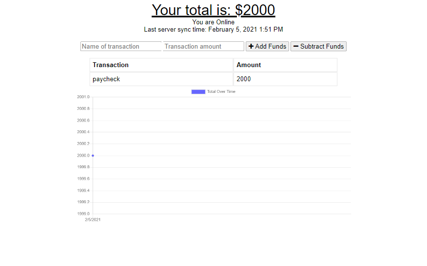

#  Online/Offline Budget Tracker

This is a budget tracker app that has been upgraded to work online and offline.  The app syncs to the server when there is an internet connection, but it can also work offline and then will sync the data the next time an internet connection is detected. This progressive web application utilizes browser caching and IndexedDB.

 
 

## Table of Contents

* [Installation](#Installation)
* [Usage](#Usage)
* [License](#License)
* [Contributing](#Contributing)
* [Tests](#Tests)
* [Questions](#Questions)

 
 

## Screenshot

 
 

## Installation

Use an internet browser and go to https://offline-online-budget-tracker1.herokuapp.com/

 
 

## Usage

Enter a transaction name and ammount.  Then, select add or subtract funds.

 
 

## License

[GNU GPLv3](https://choosealicense.com/licenses/gpl-3.0/)

 
 

## Contributing

If you would like to contribute, please open an issue in Github.

 
 

## Tests

No tests have been written.

 
 

## Questions  

If you have questions about the project you can email me, or you can open an issue in the GitHub repository.

My GitHub profile is [BenjDG](https://github.com/BenjDG)  
  
Email: bdgalloway85@gmail.com.  
